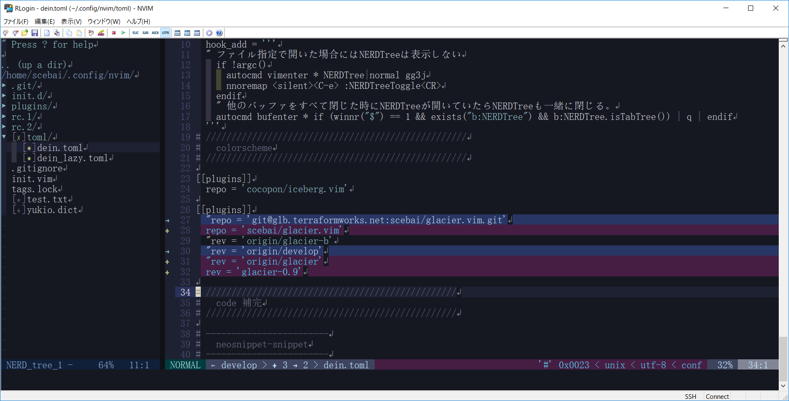

Iceberg is a well-designed, eye-friendly, dark blue color scheme for Vim and
Neovim.


Overview
--------
Glacier is a dark blue color scheme for Vim. Forked from [cocopon/iceberg.vim](https://github.com/cocopon/iceberg.vim)





# Features
- 256-colors terminal support
- [lightline][lightline] colorscheme
- [Neovim][neovim] terminal colors support


# Philosophy
Creator of Iceberg talked about how to create your lovely color scheme in
[VimConf 2017][vimconf2017], international Vim conference.
[This presentation][vimconf-presentation] also explained the philosophy of
Iceberg.

[][vimconf-presentation]


# Building your own Iceberg
1. Install [cocopon/pgmnt.vim][pgmnt], a template engine for Vim color scheme,
   to your Vim.

2. To modify a color palette, edit `autoload/iceberg/palette/dark.vim`. If you 
   make changes, be sure to `:source` this file before step 4 otherwise your
   color palette changes will not be reflected.

3. To modify highlighting groups or links, edit `src/iceberg.vim`.

4. After editing, compile the source file as below:

   ```vim
   :e src/iceberg.vim
   :cd %:h
   :source %
   ```

   Compiled files will be output into `autoload` directory.


# For other environments
- [Terminal.app profile](https://cocopon.github.io/iceberg.vim/#macosTerminalApp) by [cocopon](https://github.com/cocopon)
- [iTerm2](https://github.com/aseom/dotfiles/blob/master/osx/iterm2/iceberg.itermcolors) by [aseom](https://github.com/aseom)
- [Atom](https://github.com/cocopon/atom-iceberg-syntax/) by [cocopon](https://github.com/cocopon)
- [Xcode](https://github.com/cocopon/xcode-iceberg) by [cocopon](https://github.com/cocopon)
- [AppCode](https://github.com/Kuniwak/iceberg.icls) by [Kuniwak](https://github.com/Kuniwak)
- [Fish](https://github.com/pkazmier/dotfiles/blob/master/.config/fish/functions/bobthefish_colors.fish) by [pkazmier](https://github.com/pkazmier)

- [airline][airline] colorscheme is not support.


# License
MIT License. See `LICENSE.txt` for more information.


[ale]:https://github.com/w0rp/ale
[airline]:https://github.com/vim-airline/vim-airline/
[lightline]:https://github.com/itchyny/lightline.vim
[neovim]:https://neovim.io/
[pgmnt]:https://github.com/cocopon/pgmnt.vim
[signify]:https://github.com/mhinz/vim-signify/
[sneak]:https://github.com/justinmk/vim-sneak
[startify]:https://github.com/mhinz/vim-startify
[syntastic]:https://github.com/vim-syntastic/syntastic
[terminal-sexy]:https://terminal.sexy
[typescript-vim]:https://github.com/leafgarland/typescript-vim
[vim-flow]:https://github.com/flowtype/vim-flow
[vim-graphql]:https://github.com/jparise/vim-graphql
[vim-javascript]:https://github.com/pangloss/vim-javascript
[vim-markdown]:https://github.com/tpope/vim-markdown
[vim-plug]:https://github.com/junegunn/vim-plug
[vim-zenspace]:https://github.com/thinca/vim-zenspace
[vimconf-presentation]:https://speakerdeck.com/cocopon/creating-your-lovely-color-scheme
[vimconf2017]:https://vimconf.vim-jp.org/2017/
[xresources]:https://gist.github.com/cocopon/1d481941907d12db7a0df2f8806cfd41
