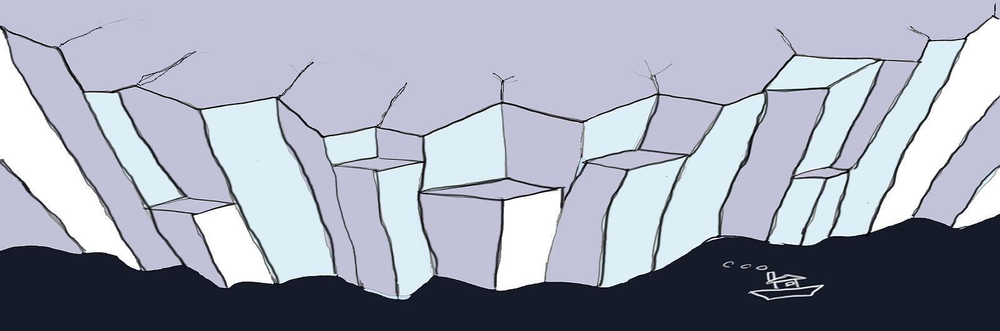

Overview
--------
Glacier is a dark blue color scheme for Vim. Forked from [cocopon/iceberg.vim](https://github.com/cocopon/iceberg.vim)

Features
--------
- 256-colors terminal support
- [lightline][lightline] colorscheme
- [Neovim][neovim] terminal colors support

- [airline][airline] colorscheme is not support.

License
-------
MIT License. See `LICENSE.txt` for more information.

[airline]:https://github.com/vim-airline/vim-airline/
[lightline]:https://github.com/itchyny/lightline.vim
[neovim]:https://neovim.io/
